# RBY MMO

### Kanto, but your friends are in it.

Other trainers walk the same routes you do — real sprites, names over their
heads, chat bubbles when they talk. Bump into someone outside Viridian and
trade on the spot. Or throw down, right there on the grass.

A multiplayer mod for [Gen1Recomp](https://github.com/bryanthaboi/gen1recomp).


**No server to rent. No accounts. No signup.** One of you hosts from inside
the game — you're a player, your copy is just also the relay.

---

## 🎮 Get in

**1. Install it.** Grab `rby_mmo-<version>.zip` from
[Releases](https://github.com/alamops/RBYMMOMod/releases), then in the game:
**MODS → Import mod .zip**. That's the whole install — the archive carries
`manifest.json` at its root, which is the shape the importer expects, so it
also unzips into your `mods/` folder by hand if you'd rather.

Every release ships a `sha256sums.txt` beside the zip if you want to check
what you downloaded.

**2. Turn it on.** Launch the game, press **F10**, enable **RBY MMO**, and
let it restart when it asks. It ships flagged `experimental`, so it stays off
until you say otherwise — installing it is never what opens a socket.

**3. One of you hosts.** `START → MMO → HOST GAME`.

Character creation comes first: pick a **NAME** (your save file keeps its
own) and a **LOOK** from the 36 walking characters in the game. Confirm, pick
a room size, and you're live.

The HOST screen mints a **six-character passcode** on the way in and shows it
in the `JOIN CODE` row — `A7K3P9`, letters and digits, no dashes. There's
nothing to type and no way to host without one: every game has a door on it.
Change it from that row if you'd rather pick your own.

<p align="center">
  
  
  
</p>

The menu's **ADDRESS** row then shows something like `192.168.1.125:7788`
with `CODE: A7K3P9` on the line under it — they're read out in the same
breath, so they're shown in the same box.

**4. Everyone else joins.** `START → MMO → JOIN GAME`, make their own
trainer, then **the address and the passcode**, in that order, before
anything is dialled. (**SELECT** flips the keyboard to digits — the vanilla
one has none.)

An IP or a hostname both work — `192.168.1.125:7788` or
`MYBOX.EXAMPLE.COM:7788` — and leaving the port off fills in **7788**. Case
doesn't matter for a hostname; DNS doesn't care either. Dashes, spaces and
lower case in a passcode are normalised away, so one copied out of a chat
message works as typed.

**Staying current.** The manifest points at this repo, so the launcher's
mod list checks Releases for you and offers the newer build under **Other
versions** — you don't have to come back here to find out something shipped.
It only ever asks; nothing updates itself behind you.

Everyone on the same Wi-Fi or LAN can join straight away — no configuration,
just the address and the passcode. Across the internet the host has to
forward port **7788** — or nobody forwards anything and you all join a
standalone hub on a box that already has a public address instead
([server/README.md](server/README.md)).

That's the five-minute version. **[Setting a game up — both ways](#-setting-a-game-up--both-ways)**
walks the full configuration of each path, screen by screen.

---

## ⚡ Features

```
╔════════════════════════════════════════════════════════════╗
║  SHARED KANTO      up to 64 trainers, one live overworld   ║
║  ZERO SETUP        one of you hosts from inside the game   ║
║  FULL LINK SUITE   trade + battle, anywhere on the map     ║
╚════════════════════════════════════════════════════════════╝
```

### 👥 THEY'RE REALLY THERE
Every other player on your map is a **genuine overworld NPC** — right sprite,
right depth sorting, right palette — walking tile to tile on the engine's own
16-frame step clock. Not a sprite bolted on top. Nameplates ride over their
heads; chat bubbles pop when they talk.

<p align="center">
  
  
</p>

### 🤝 TEAM UP
Walk up to a friend, press **A**, pick `INVITE`. They get asked; if they say
yes you're a **party** — you and one other trainer, and that's the whole
design, not a first step towards six.

<p align="center">
  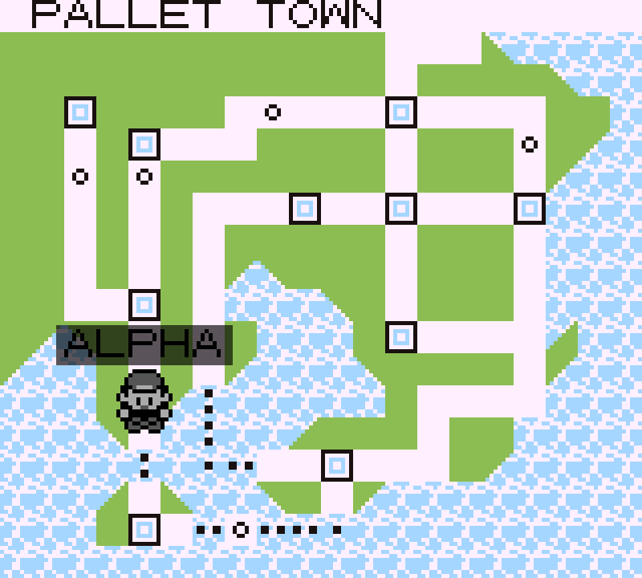
  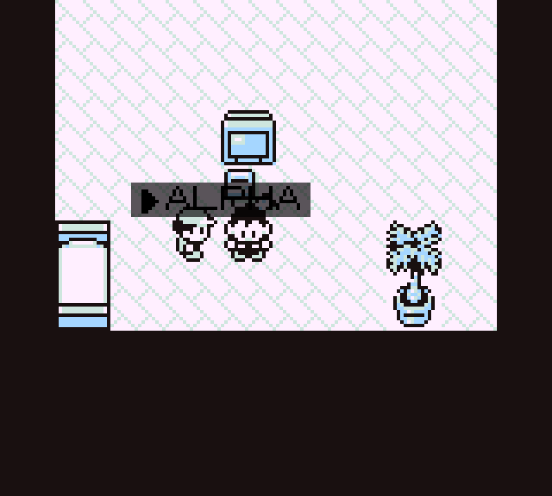
</p>
<p align="center">
  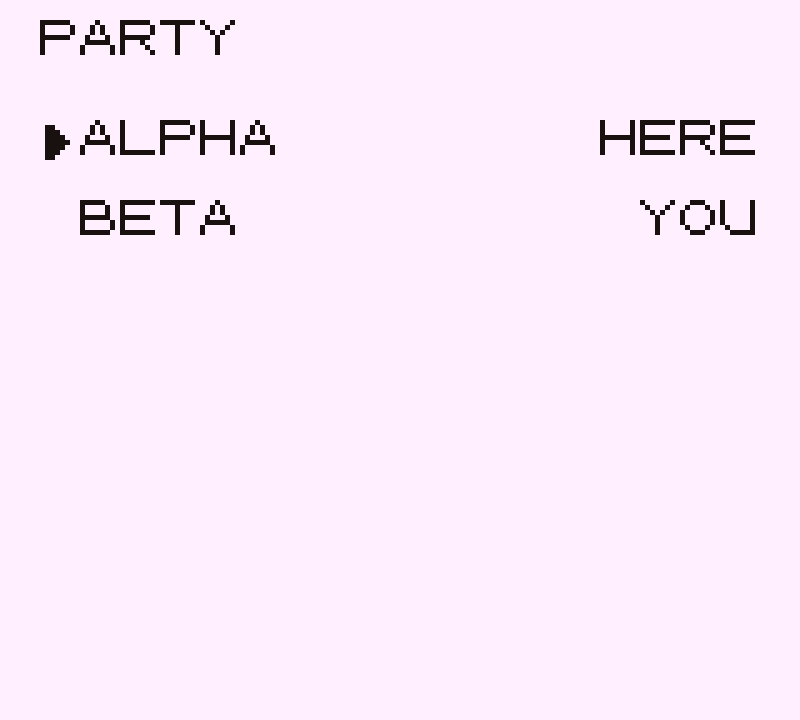
  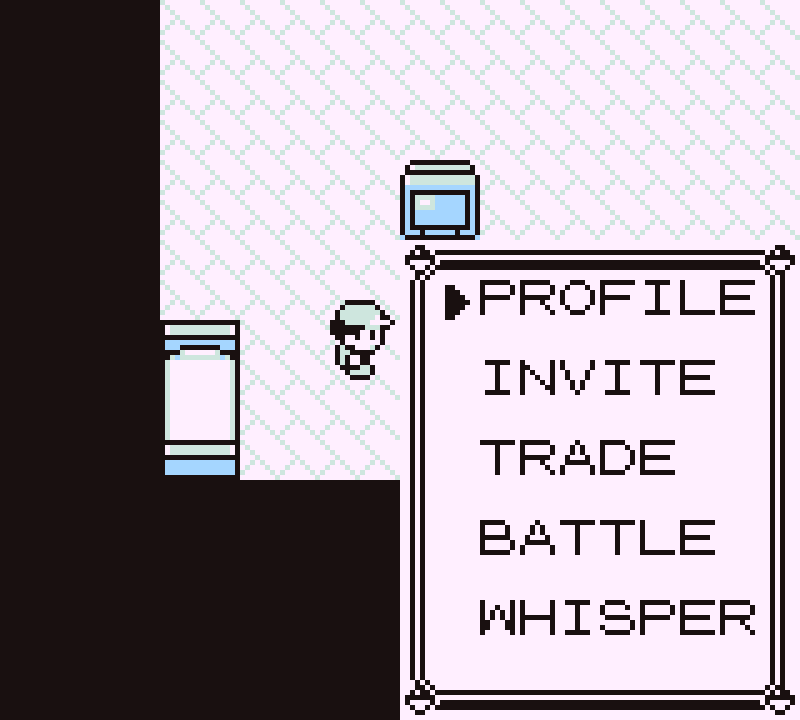
</p>

What a party buys you:

- **open the TOWN MAP and they're on it** — their character standing at the
  city they're actually in, right now, with their nickname over it. Kanto
  already had a screen for "where is that", and this is that question with a
  person as the answer. It updates as they walk;
- **them in the world too**, when you're on the same map — their character
  with a `▶` in front of their nickname over its head, so you can pick your
  friend out of a crowd at a glance. `PARTY` next to their name on the
  `PLAYERS` list says the same thing in menu form;
- a chat scope that reaches them **wherever they are** — no radius, no name
  to type;
- a `PARTY` row on the MMO menu holding the members list (their card is one
  press away, and so is yours), and the way out.

The `INVITE` row only appears when a party could actually be formed — neither
of you already in one — because a button whose usual answer is *no* is worse
than no button. Either of you leaving ends it for both; at two people there
is no party left to continue. So does either of you disconnecting.

### 💬 TALK TRASH ON A GAME BOY KEYBOARD
Four scopes, composed on the vanilla naming grid:

| Scope | Who hears it | Floats over your head |
| --- | --- | --- |
| `EVERYONE` | the whole hub | ✅ |
| `NEARBY` | same map, 12 tiles | ✅ |
| `PARTY` | the friend you teamed up with, anywhere | ✅ |
| `WHISPER` | one player | ❌ — it's a whisper |

A party line bubbles and a whisper does not, and that is the same rule rather
than an exception to it: a bubble is only ever drawn in the game of somebody
who *received* the line, and the hub sends a party line to the party alone.

Unread messages flag the menu with `CHAT*`. And because the vanilla grid has
**no digits at all**, this mod adds a number page to its own screens —
**SELECT** flips `ABC` ⇄ `123`.

### 🔁 TRADE — ANYWHERE
No Cable Club. No Pokémon Center. Walk up, press **A**, pick `TRADE`. It runs
the engine's *own* `TradeSession`, untouched — so your Kadabra still evolves,
and the mon still gets stamped as traded with the original OT.

### ⚔️ BATTLE — ANYWHERE
Same deal, on the grass where you're standing. The real lockstep simulation a
link cable runs, carried over the wire. **Zero desyncs** across the full
end-to-end suite.

<p align="center">
  
  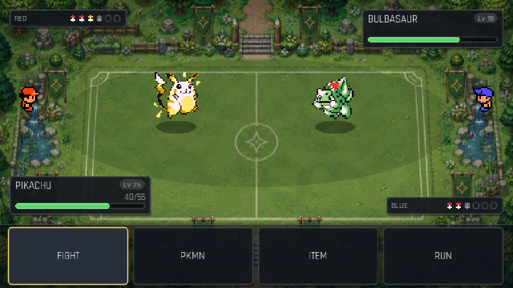
</p>

### 🏆 RANKED — AND YOU CAN'T FARM IT
Every link battle is scored, on the hub, for both players. Win and you gain
points; lose and you lose them, never past **0**. How many depends on who you
beat: turn over somebody 300 points above you and it's worth **27**, beat
somebody 300 below and it's worth **5**. Elo, in other words — so hunting the
weakest player in the room pays almost nothing.

And it pays less every time. Beating the *same person* again inside an hour
is worth half, then a quarter, then nothing — counted in both directions, so
you and your friend can't take turns either. Play them all you like; the
sixth rematch of the hour just isn't worth points.

**Neither of you can lie about it.** Both games report how the battle ended
and the hub scores it only when the two reports agree — one side claiming a
win is worth exactly nothing. A dropped link is a draw for the player still
standing, and a draw scores nothing, so nobody loses points to somebody
pulling the cable out (and nobody can farm by pulling it either).

`RANK` on the MMO menu is the top ten, best first: place, the character
they're wearing, name, points. Players who've never won aren't on it — 0
points means unranked, which is where everybody starts.

<p align="center">
  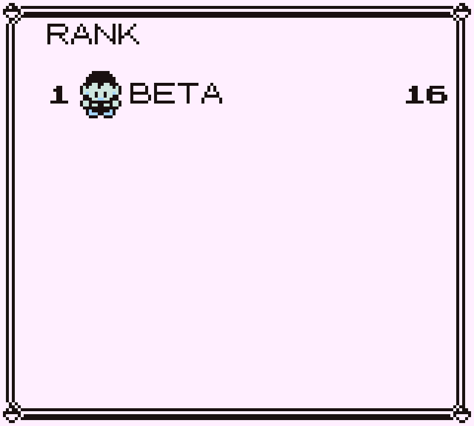
</p>

Your own points are on your trainer card, on the badge row, and so are
everybody else's on theirs. A dedicated hub keeps the season in
`ranking.json` between restarts; a game hosted from inside somebody's copy
scores a fresh one each time it opens.

**And the name is yours.** The first time a hub sees your trainer name it
mints a secret, hands it to your copy once, and remembers only its hash; your
game presents it every time you come back, and that is what says *same
player*. Somebody who types your nickname without it plays normally — walks,
chats, trades, battles — and simply doesn't score, which the `RANK` screen
tells them in as many words. Nobody is thrown out for it: a friend who lost
their save shouldn't lose the hub.

Be clear about what that is worth. It's a **claim ticket, not an account**:
it lives in your save file and crosses the same unencrypted link the join
code does, so anyone who can read either can take the name. What it buys is
that *typing* someone's nickname is no longer enough — which, until it
existed, was the whole story.

### 🏠 YOU ARE THE SERVER
`HOST GAME`, pick a room size (**2–64**), done. You're a normal player who
happens to be the relay — you walk, chat, trade and fight like everyone else.

The catch is in that sentence: the relay is running inside *your* copy, so
when you quit, everyone's game ends. Fine for an evening on the sofa. If you'd
rather nobody's exit could do that — including yours — run the standalone hub
instead: same protocol, joiners can't tell the difference, and it has no host
to lose.

### 🔑 EVERY GAME HAS A DOOR ON IT
**A six-character passcode is required, both ways.** Hosting from the game
mints one and shows it on the HOST screen; the standalone hub refuses to
start without one. There is no open-world setting on either side. Six
characters (`A7K3P9`) from an alphabet with `I L O U` left out, so nothing is
misread off a screenshot or misheard over voice, and every character is on
the mod's own naming grid.

Where the standalone hub goes further is everything *around* the passcode: it
mints codes from a real CSPRNG, throttles wrong ones per address *and*
hub-wide, and adds per-address connection limits, bans, an allowlist, a
`doctor` that tells you who can actually reach your machine, and a hub that
stays up when you're not playing. Configure the lot from one command —
`docker compose up`, or `node server/bin/rby-mmo-hub.js init`.

**Six characters is 30 bits, and that is not much.** It keeps strangers out;
it does not survive somebody who can capture your traffic, because none of
this is encrypted. [server/README.md](server/README.md) does the arithmetic
in full and does not soften it.

### 🚪 DROP OUT, KEEP PLAYING
`LEAVE` disconnects and hands you straight back to single-player. Save,
world, party — untouched. No "returning to title screen".

### 🎭 BE SOMEBODY ELSE
Before you host or join, character creation asks who you are: a name of your
own (your save file keeps its own), and **any walking character in the
game** — 36 of them. Be Lance. Be Giovanni. Be a Rocket grunt, a Biker, a
Swimmer, Oak. You see it too, not just everyone else — and it's put back the
moment you leave.

If someone picks a character your ROM doesn't have, they show up as RED on
your screen rather than not at all.

### 🪪 CHECK THEIR CARD
Walk up, press **A**, and **PROFILE** sits at the top of the menu — their
trainer card, laid out like your own:

<p align="center">
  
</p>

Their name, the character they're wearing on the line beneath it, their
portrait, trainer ID, hours played, badges earned, and how much of the dex
they've seen and caught. Not their money — that's nobody else's business, so
it isn't shown and isn't sent.

The character gets a whole row to itself because the longest name in the
game, `MIDDLE AGED WOMAN`, is exactly as wide as one. The portrait sits
beside `IDNo` and `TIME` instead — the two rows whose width can't vary.

**`MY PROFILE`** on the MMO menu opens the same card for you — the same
rows in the same places, so what you check before showing off is exactly
what everyone else is reading:

<p align="center">
  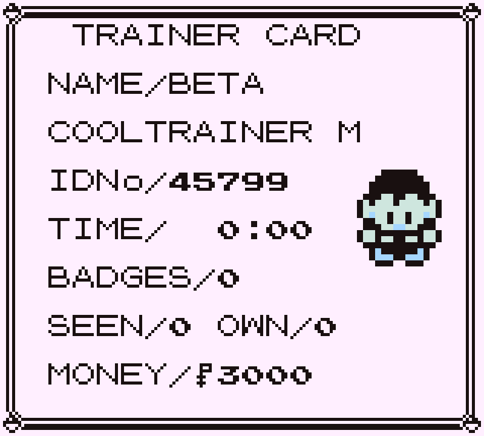
</p>

Yours adds one row nobody else's has: `MONEY`. It's drawn from your own
save and never goes on the wire — `Wire.profile` refuses to carry it, so a
card with money on it can only be your own.

Both cards carry `RANK` on the badge row, right-aligned — the live number the
hub holds, not a snapshot of whoever joined an hour ago. It shares that row
because the card has seven rows at this spacing and all seven were already
spoken for, and `BADGES/8` is the one that leaves most of its row empty.

### 🧩 STACKS WITH OTHER MODS
Spawning real NPCs means whoever owns the world pass draws your friends too.
Run it with a voxel renderer and they show up **as voxel characters**, no
work required.

---

## 🕹️ The menu

`START → MMO` is a bordered box in the corner like any other START submenu.
B goes back. The cursor remembers where you left it. The world stays visible
behind it.

<p align="center">
  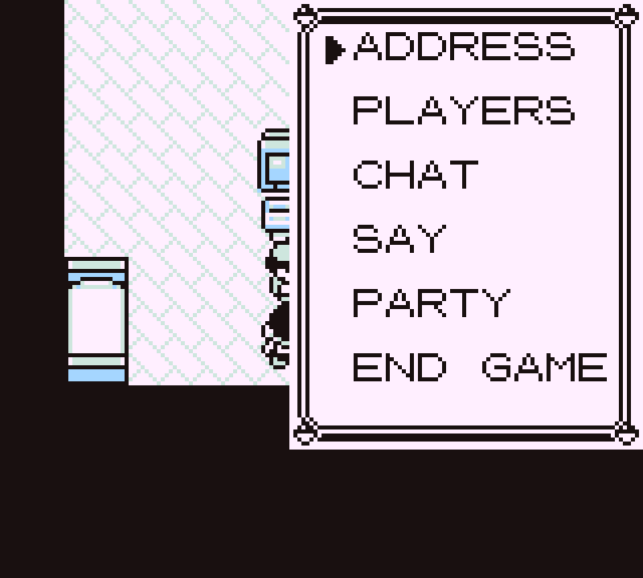
</p>

| Row | Shows up when | What it does |
| --- | --- | --- |
| `HOST GAME` | not in a game | make a trainer, then the room size and the passcode |
| `JOIN GAME` | not in a game | make a trainer, then the address and the passcode |
| `ADDRESS` | hosting | your address again — for when someone asks *again* |
| `PLAYERS` | connected | who's on, `n/limit` if you're hosting |
| `CHAT` / `SAY` | connected | the log (`▶CHAT` = unread) and sending |
| `PARTY` | connected | your party: members, party chat, and leaving it |
| `MY PROFILE` | connected | your own trainer card, as everyone else sees it |
| `RANK` | connected | the hub's top ten: place, character, name, points |
| `LEAVE` | you joined | drop out and **keep playing single-player** |
| `END GAME` | hosting | asks first — this one ends it for everybody |

Two rows before you're in a game, and no third one for the passcode:
`JOIN GAME` asks for it on the way in, so typing a different one there is how
a saved passcode gets changed. (The screenshot above is the menu mid-game,
which is why it shows neither.)

Leaving isn't quitting. Your save, your world, your party: untouched. The
game just carries on without the other people in it.

Pressing **A** at another trainer opens a second, smaller box —
`PROFILE` / `INVITE` / `TRADE` / `BATTLE` / `WHISPER` — about that player.
`INVITE` is there only while a party could be formed: it disappears once
either of you is in one, and comes back when that party ends.

`PARTY` leads to a menu of its own once you're in one:

| Row | What it does |
| --- | --- |
| `MEMBERS` | both of you, with `HERE` / `AWAY` / `BUSY` next to them — and either card |
| `SAY` | a line to your party, wherever they are |
| `LEAVE` | asks first, then ends the party for **both** of you |

Before you're in one, the row explains how a party starts and drops you on
the `PLAYERS` list to start one from.

---

## ⚙️ Options

`MMO` in the mod manager (`F10`):

| Option | Default | Does |
| --- | --- | --- |
| `MAX PLAYERS` | 4 | room size for games you host (2–64, you count) |
| `JOIN` | `127.0.0.1:7788` | where JOIN GAME starts from |
| `JOIN CODE` | *(empty)* | the passcode used for a hub you haven't typed one for |
| `MY SPRITE` | RED | how everyone else sees you |
| `BUBBLES` | on | names and chat over heads |

These are just the *defaults* — HOST GAME asks the room size every time and
JOIN GAME lets you type an address and a passcode, and those in-game choices
stick with your save. (Mods can read their options but not write them, so the
in-game values live in the save file instead of overwriting the rows above.)

A passcode typed for a particular hub is stored **against that hub's
address**, so playing on two of them means typing neither twice. The `JOIN
CODE` row above is the fallback for a player who only ever plays on one.

Typing an address uses the number page described above — **SELECT** flips
`ABC` ⇄ `123`. Every other naming screen in the game is left untouched.

---

## 📡 Setting a game up — both ways

There are two ways to put a world on the network, and **a joining player
cannot tell them apart**: same protocol, same handshake, same passcode rules.
Pick by how long you want the world to outlive the session.

| | Hosting from the game | A dedicated hub |
| --- | --- | --- |
| Configured with | the HOST screen | `rby-mmo-hub`, or `docker compose` |
| Needs a terminal | no | yes, once |
| Who is the host | one of the players | **nobody** |
| **If the host quits** | **the game ends for everyone** | n/a — there isn't one |
| **If any other player quits** | everyone else carries on | everyone else carries on |
| World survives an empty room | no — it ends with the host | yes, it just sits there |
| Ranked points | kept while the game is open | kept in `ranking.json`, across restarts |
| Passcode | minted on the HOST screen | minted by `init`, or you pick it |
| Passcode entropy | the game's own pool, **not** a CSPRNG | `crypto.randomBytes` |
| Bans, allowlist, per-address limits | — | yes |
| Good for | the same Wi-Fi, an evening | friends across the internet, 24/7 |

The two bold rows are the whole difference. Hosting from the game puts the
relay **inside one player's copy**, so that player is a single point of
failure for everybody: their phone rings, they quit, and the world goes with
them. A dedicated hub has no such player — every seat is equal, anyone can
come and go, and the world is still there tomorrow. Nothing else in this
table is worth switching for; that is.

Everything below is *configuration*. For the five-minute version, see
[Get in](#-get-in).

### 🏠 Local LAN — configured entirely in-game

No files and no terminal. `START → MMO → HOST GAME`, make a trainer, and
every setting a hosted game has is on one screen:

<p align="center">
  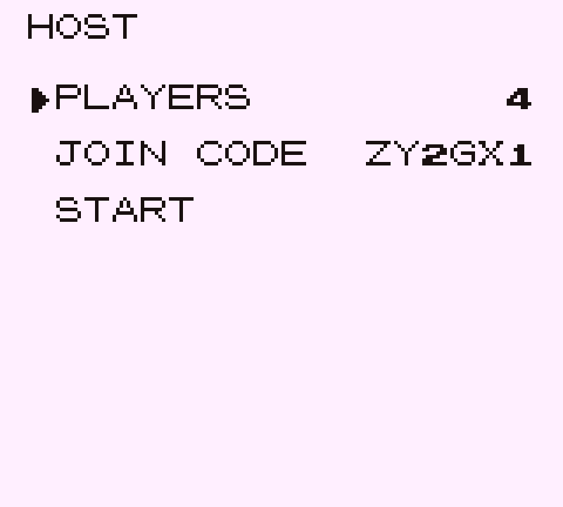
  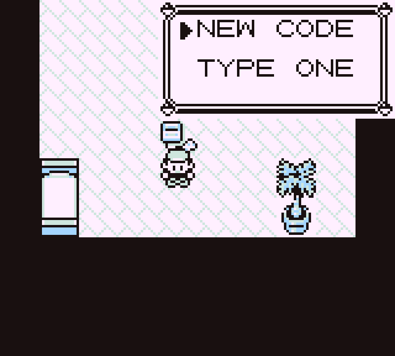
  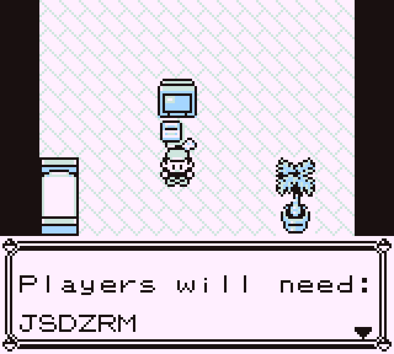
</p>

- **`PLAYERS`** — the room size, **2–64**, you included. Change it as often as
  you like before starting; it is fixed for the life of the game once you do.
- **`JOIN CODE`** — already filled in. The screen mints one on the way in, so
  the common case is that you read it out and never touch this row.
  **`NEW CODE`** rerolls it — that is why the code above changes from `ZY2GX1`
  to `JSDZRM` between the first screenshot and the third. **`TYPE ONE`** lets
  you choose your own on the naming grid.
- **`START`** — opens the port. There is no way past this screen without a
  passcode; if you clear one, `START` sends you back here rather than opening
  an unprotected world.

Once you're live, the menu's **`ADDRESS`** row is what you read out. The
address and the passcode are shown in one box because they're always said in
one breath:

<p align="center">
  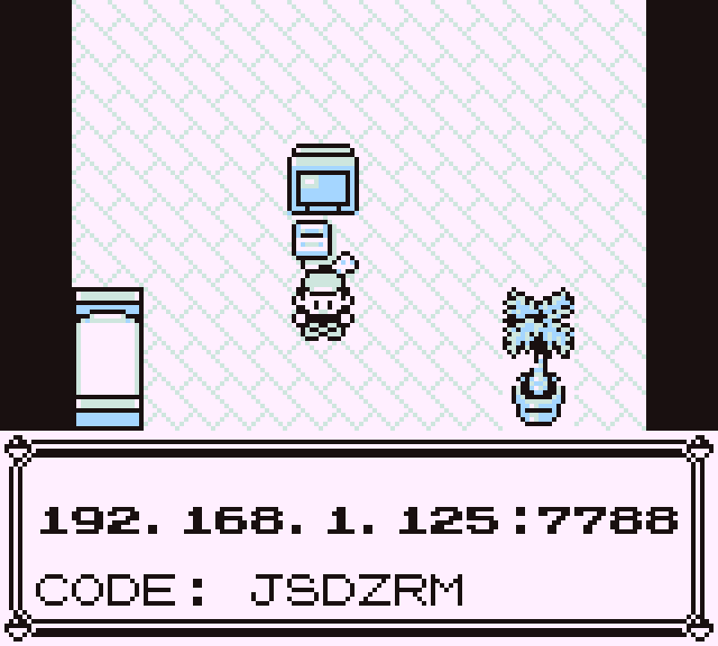
</p>

Everyone on the same Wi-Fi can use that address as-is. From outside your
network, someone has to forward port **7788** to your machine — or you skip
that entirely and use a dedicated hub on a box that already has a public
address.

> **A passcode minted in-game is not from a CSPRNG.** LÖVE ships no such
> source, so the game stirs its own entropy pool from frame and input timings.
> It claims 64 bits of pool, which is well past the 30 bits a six-character
> code can carry — fine for a LAN game. A hub facing the open internet should
> be the dedicated one below, whose codes come from `crypto.randomBytes`.

### 🖥️ A dedicated hub — configured entirely through one command

Lives in [`server/`](server/README.md). Node 22+, **zero dependencies**, or a
container. Every setting is reachable from the CLI — nothing requires editing
a file by hand.

**First run** writes a config at mode `0600` and prints the passcode once:

```console
$ node server/bin/rby-mmo-hub.js init --yes --port 7788 --max 8
Configuration written to /srv/rby-mmo/config.json (mode 0600, readable only by you).

  listening on   0.0.0.0:7788
  players        up to 8
  join code      required (always -- there is no open-hub setting)
  log level      info

Your join code

      +------------+
      |   214FYC   |
      +------------+

  Give that to the friends you want in your world. They type it once,
  in game, on the screen where they enter this hub's address. Anyone
  without it is refused, in one sentence, and cannot get in.

  This is the only time it is printed in full. To see it again:
      rby-mmo-hub invite list --reveal
```

**Or choose the passcode yourself** — including the same one you use for your
in-game LAN games, so friends only ever learn one:

```console
$ node server/bin/rby-mmo-hub.js init --yes --code gengar
  join code      required (always -- there is no open-hub setting)

Your join code, the one you chose

      +------------+
      |   GENGAR   |
      +------------+
```

Mind the alphabet — `I`, `L`, `O` and `U` are not in it, so plenty of words
don't survive. `--code kanto1` is refused, because `KANTO1` without the `O` is
five characters, and it tells you so:

```console
$ node server/bin/rby-mmo-hub.js init --yes --code kanto1
--code: that is not a passcode this hub can use.
A passcode is 6 characters from 0123456789ABCDEFGHJKMNPQRSTVWXYZ
-- the digits and the capital letters except I, L, O and U, which are
left out so nothing is mistyped off a screenshot. Dashes, spaces and
lower case are fine; they are normalised away.
```

**Everything else** is a verb. Codes are masked unless you ask, so the listing
is safe to screen-share:

```console
$ rby-mmo-hub invite list
ID       LABEL              CREATED           EXPIRES  USES  STATUS  CODE
primary  Primary join code  2026-08-03 17:48  never    0     active  ******

Codes are masked. --reveal prints them in full.
```

| Want to | Run |
| --- | --- |
| run it | `rby-mmo-hub start`, or `docker compose up -d` |
| hand out a second code | `rby-mmo-hub invite --label ash --expires 24h --uses 1` |
| take one back | `rby-mmo-hub revoke <id>` |
| change any setting | `rby-mmo-hub config set maxPlayers 8` |
| see where a value came from | `rby-mmo-hub status` |
| throw somebody out | `rby-mmo-hub ban 203.0.113.7` |
| check it's actually reachable | `rby-mmo-hub doctor` |

`doctor` is the one to run before you tell anyone the address — it checks the
configuration, then says plainly whether friends outside your network will
reach the port at all:

```console
$ rby-mmo-hub doctor
Configuration
  [ ok ] a join code is required; 1 usable of 1
  [ ok ] wrong passcodes are throttled: 3 free per address per 10m, backing
         off from 2s to 5m; 100 hub-wide in 1m shuts new joins for 1m
  [ ok ] port 7788 is in the unprivileged range
  [warn] limits.perIpConnections (4) is not below maxPlayers (4), so one
         address could take every seat

Reachability
  Addresses on this machine:
    en0     198.51.100.24    public address
    en0     192.168.1.125    private network
    lo0     127.0.0.1        loopback (this machine only)
```

Credentials, bans and the allowlist reload on `SIGHUP`, so revoking a leaked
passcode doesn't interrupt the people already playing. The full config table —
every key, default and bound, including the seven that tune the wrong-passcode
throttle — is in [server/README.md](server/README.md).

### 🚪 Joining — identical either way

Address first, then passcode, both **before anything is dialled**. An IP or a
hostname both work, and leaving the port off fills in `7788`:

<p align="center">
  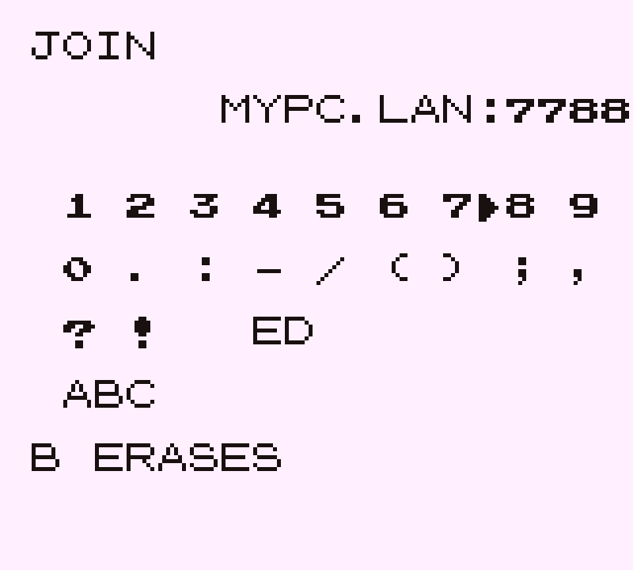
  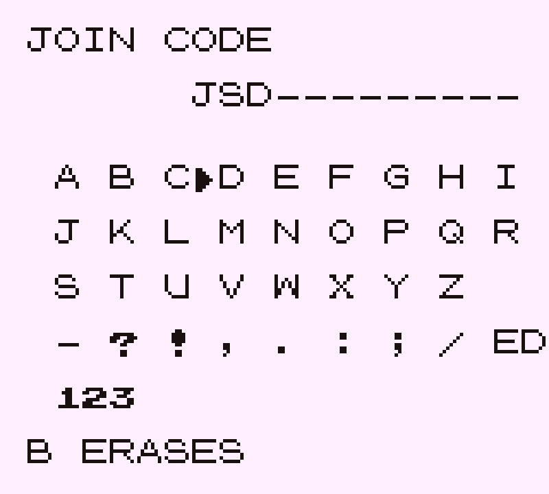
</p>

**SELECT** flips the keyboard between letters and digits — the vanilla one has
no numbers at all, which is why this mod ships its own. Dashes, spaces and
lower case are normalised away, so a passcode pasted out of a chat message
works exactly as typed. **`B` erases, and on an empty line it backs out** —
the screen says which, depending on what you've typed, because there's
otherwise no way to tell.

Then you're standing in their world:

<p align="center">
  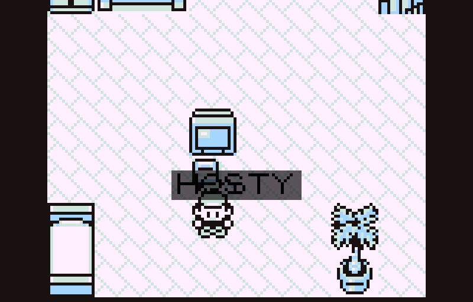
</p>

Get the passcode wrong and the hub says so in one sentence and leaves you
outside — the grid comes back with what you typed still on it, so a single
wrong character costs one press to fix rather than six.

Both the address and the passcode are stored **per hub**, so playing on two of
them means typing neither of them twice.

---

## 🧩 Plays nice with other mods

Tested against
[DramaticShapeVoxelMod](https://github.com/DramaticShape/DramaticShapeVoxelMod):
both load clean, and everything — presence, chat, trade, battle — works with
the voxel diorama running.

Your friends show up as **voxel characters**, free of charge. That's the
payoff for spawning real NPCs instead of drawing avatars: whoever owns the
world pass draws them too.

Nameplates are the one thing that can't follow into 3D — they're positioned
by tile offset, which only means anything in the flat projection. So when
another mod owns the world, the overlay names nearby players in a corner list
instead. You lose the arrows, nothing else.

It's entirely optional, and that's a *checked* claim — the test suite runs
both ways and pins which:

```sh
MMO_WITHOUT_MODS="DRAMATIC_SHAPE" bash mods/rby_mmo/tests/drivers/run-mmo-e2e.sh
MMO_WITH_MODS="DRAMATIC_SHAPE"    bash mods/rby_mmo/tests/drivers/run-mmo-e2e.sh
```

---

## 🔬 Prove it

> Everything below is for working *on* the mod, not for playing it. Players
> need none of it — install, enable, host. The scripts here assume a
> Gen1Recomp source checkout with this folder linked in at `mods/rby_mmo`.

**Running it from source.** Copy `.env.example` to `.env`, point `ROM_PATH`
at your own ROM, and:

```sh
bash mods/rby_mmo/tools/play.sh          # boots past the ROM screen, mod on
bash mods/rby_mmo/tools/play.sh guest    # a second window, separate save
```

Two windows on one machine is the quickest way to exercise host↔join while
developing — host in the first, then join `127.0.0.1:7788` from the second
with the passcode the HOST screen is showing. It is not how anyone should
actually play; that's the LAN flow above.

**The suites.**

```sh
luajit mods/rby_mmo/tests/rby_mmo_test.lua   # from the engine root
node server/hub.test.js                      # from this folder
node server/rank.test.js                     # and the ranked half of it
```

The first drives the real headless loader — same `Loader`, same merge the
game uses — and hammers the protocol logic with fake peers. The second boots
the Node hub as a child process and drives it over real sockets. The third is
ranked PVP on the Node side, and it exists as a pair: the same table of
numbers is asserted in `rby_mmo_test.lua`, because two hubs that price a win
differently are two rankings, and the only thing keeping them together is two
suites checking the same answers.

But neither of those ever binds a socket, renders a menu, or spawns an
avatar. **This does:**

```sh
bash mods/rby_mmo/tests/drivers/run-mmo-e2e.sh
```

Two real LÖVE instances. Separate saves. A real socket between them. One
hosts, one joins, and both sides assert:

- ✅ the listener comes up and publishes an address you can re-read later
- ✅ each player lands on the other's roster
- ✅ avatars **walk** to where the network says they are — not teleport
- ✅ leaving a map despawns the avatar but keeps the player listed
- ✅ chat crosses both ways
- ✅ pressing A on someone opens TRADE / BATTLE
- 🔁 **a trade completes** — each side ends holding the other's Pokémon
- ⚔️ **a link battle runs to a decision**, zero `link.desync` on either side
- 🏆 **and it is scored** — both sides report it, the hub settles it, and the
  winner is on the leaderboard when `RANK` is opened
- ✅ a guest LEAVEs and keeps playing
- 🎫 **and can come back as themselves** — the guest rejoins through the real
  menus, is recognised by the claim ticket its save kept, and finds its
  rating where it left it

The dedicated-hub run — `run-hub-e2e.sh`, two guests and a real Node hub, no
in-game host anywhere — adds the party leg on top of all of that:

- 🤝 `INVITE` is on the menu, the other side is asked, and **a party forms**
- ✅ **your party member is in the world** — their character spawned as a real
  NPC at the cell the network says, with their marked nickname drawn over its
  head, read back off a live frame via `overlayState().names`. Every glyph
  the overlay drew is then checked against the real extracted charmap, which
  is not paranoia: the first version of that marker was a `*`, which drew a
  blank hole because the font has no asterisk, and passed every string-level
  assertion that existed at the time
- 🗺️ **and on the TOWN MAP** — a real `src.ui.TownMap` is opened and the
  overlay is asked what it drew on it: their character placed at the city
  their current map resolves to, named
- ✅ the party flag reaches the *other* player's roster (this is the one that
  caught a real bug: the flag rode on a presence update the client was
  throwing away, so `INVITE` went on being offered against somebody who could
  no longer accept it)
- ✅ the members list opens and lists both of you
- ✅ a party line crosses the hub, tagged `party`
- ✅ the party survives a trade *and* a link battle
- ✅ one member pressing `LEAVE` ends it for **both**, and frees them in
  everyone else's presence

Screenshots land in `/tmp/rby_mmo_shots` so you can see it, not just read a
pass count.

> Two windows open and drive themselves. Don't click into them — you'll
> steal the input the drivers are queueing.

---

## 📦 Cutting a release

Pushing to `main` builds the installable zip and publishes it. There is no
manual step and no local build — the artifact players download is always one
GitHub Actions run away from a commit, so it can't quietly drift from the
source.

**To ship a version:** bump `version` in `manifest.json`, add the matching
`CHANGELOG.md` heading, push. The workflow takes the manifest's version when
it's ahead of every existing tag, which makes bumping the manifest the normal
way to cut a release. Failing that it falls back, in order, to a
`workflow_dispatch` input, a `[release X.Y.Z]` tag in the commit message, or
a patch bump on the newest `vX.Y.Z`. Whichever wins is written into the
manifest *inside the archive*, so an installed copy never reports a version
the release it came from doesn't have. An existing tag or release is refused
rather than overwritten.

Each run publishes `rby_mmo-<version>.zip` plus `sha256sums.txt`. The
filename matters: the launcher's update check looks for `<id>-<version>.zip`
first, and `manifest.json` sits at the archive root because that is one of
the two layouts **Import mod .zip** accepts.

**What the archive contains** is decided by `.modkitignore` — the release job
reads that same file rather than keeping a second list that could disagree
with it, so what a release hands a player is what `modkit pack` produces.
Tests, drivers, dev tooling and `docs/` stay out. `docs/` in particular holds
screenshots of a running game, which are composited from tiles, sprites and
font glyphs decoded out of the player's own ROM — fine on a page nobody
installs, not something to put in an archive that gets handed around.

---

## 🧑‍💻 Hooking in from your own mod

```lua
local mmo = mod.find("rby_mmo")
if mmo and mmo.exports.isConnected() then
  -- isHosting() tells you whether this copy is also the relay
  for _, player in ipairs(mmo.exports.players()) do
    print(player.name, player.map, player.x, player.y)
  end
  mmo.exports.say("global", "hello from my mod")
end
```

---

## 🚧 Known jank — read this bit

It's `0.2.2` and it ships flagged `experimental` on purpose. The full list
lives in `mod.card` under `differences.known`. The ones that'll actually bite
you:

- **No NAT traversal.** Hosting from the game means your friends have to
  reach *you*. LAN is effortless; over the internet somebody forwards 7788,
  or you all use a standalone hub on a box with a public address.
- **No host migration — when a player is the host.** Hosting from the game
  means the relay is running *inside* that copy of the game, so if the host
  quits, the game ends for everyone. They get told, rather than left staring
  at a frozen world. Nobody else can pick it up.
  **This does not apply to a dedicated hub**, where nobody is the host: a
  player leaving is just a player leaving, and everyone else carries on. If
  that matters to your group, that alone is a reason to run one.
- **Nameplates sit about a tile low.** You can see it in the shots above —
  the plate lands across the character's chest rather than over their head.
  This was previously written up here as drift at the edge of small maps,
  where the camera stops scrolling; that explanation doesn't survive a look
  at the engine's `Camera:follow`, which does no clamping at all. So the
  offset is real and reproducible, and the cause is still open.
- **The address field shows only thirteen characters.** You can type up to 32
  and the whole thing is used — but the engine's naming screen draws a fixed
  thirteen cells, so `127.0.0.1:7788` renders as `127.0.0.1:778` with the last
  character off the right edge. The value is correct; you just can't see the
  tail of it while you type. Hostnames of thirteen characters or fewer
  (`MYPC.LAN:7788`) fit exactly. The fix is in the engine's `NamingScreen`,
  which is upstream of this mod.
- **Only ever tested over loopback**, two instances on one desk. Real latency
  and packet loss are still an unknown.
- **No accounts, and no encryption anywhere.** A passcode is required both
  ways, so nobody walks in off the port — but there's no identity beyond
  "holds a working passcode", and two friends can be online under the same
  name. More to the point, the traffic is **not encrypted**: anyone on the
  path can read it, and anyone who captures one handshake can grind the
  six-character passcode offline in seconds, where no rate limit reaches
  them. Host for people you know, or put everyone on WireGuard/Tailscale —
  see the security posture in [server/README.md](server/README.md), which
  spells out exactly what 30 bits buys.

---

## Licence

MIT, matching the engine. Bring your own ROM — this repo ships no game data
and never will.
