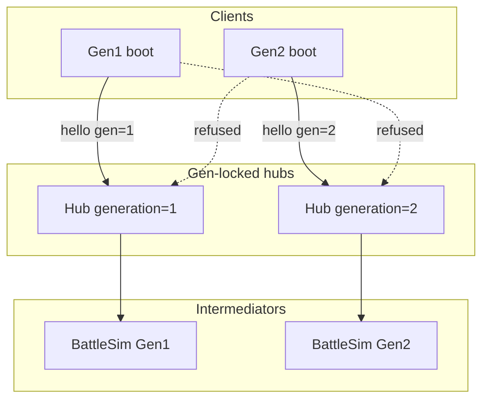

# Plan — Gen 1 + Gen 2 dual compatibility

> **Status (2026-08-11):** Waves **0–4 landed** on `feature/gen2-compatibility`.
> **Live Gold LOVE e2e green** via `tests/drivers/run-mmo-e2e-gen2.sh`: presence,
> chat, interact, trade, mediated 1v1, party, `coop_wild`, `coop_npc` (in-game
> HostServer). Skips cleanly without a Gold ROM/cache. Gen2 Start→MMO rows can
> stay unscannable after long fight stacks — drivers fall back to
> `exports.leaveParty` / `exports.leave` for teardown only.

| Field | Value |
| --- | --- |
| Date | 2026-08-11 |
| Source | `/implement` — wiki [Guide-Preparing-Your-Mod-For-Gen-2](https://github.com/bryanthaboi/gen1recomp/wiki/Guide-Preparing-Your-Mod-For-Gen-2); owner grill 2026-08-11 |
| Config | `AGENTS_CONFIG.yml` (quality preset, host cursor) |
| Branch | `feature/gen2-compatibility` |
| Base SHA | `e8a5d08a712bb5221fb4bb4d3a1dff783e573dc2` |
| Status | Waves 0–4 landed; `gen2check` **will load**; Live Gold LOVE e2e **passed** full product legs (`run-mmo-e2e-gen2.sh`). ROM/cache still required to run. |
| Gates | Interactive; owner answers locked below |

## 1. Objective & success criteria

Make **every** shipped surface of `rby_mmo` work on Gen 1 (Red/Blue/Yellow) **and** Gen 2 (Gold), with **gen-locked hubs** (a Gen 1 hub only admits Gen 1 clients; a Gen 2 hub only admits Gen 2). No Red↔Gold PVP, trade, or co-op on the same hub.

**Done means all of:**

1. `manifest.json` declares `"games": ["gen1", "gen2"]` and the claim is honest.
2. `python3 tools/modkit.py gen2check mods/rby_mmo` → clean (no errors; warnings cleared or justified in notes).
3. Headless: `T.sdk.loadMod(..., { generation = 1 })` and `{ generation = 2 }` both `state == "loaded"`, `#errors == 0`, and assert real dual-gen surfaces (money helper, overlay free-roam, avatar lookup, screen cancel ids) — not merely empty error lists.
4. **Gen 2 hub (first-class peer to Gen 1):** mediated 1v1 under **Gen 2 BattleSim** (+ Node twin), co-op 2v2 on Gen 2, Gen 2 trade (`packMon2` + held items + **party mail** on the wire).
5. Gen 1 hub: existing Gen 1 behaviour preserved (regression suite green). Both hub generations are documented run targets, not “Gen 1 default + Gen 2 later.”
6. Live e2e: Gold boot + Gen 2 hub smoke (presence, chat, mediated battle, trade incl. mail, co-op) via extended drivers under `tests/drivers/` (ROM-dependent; documented runbook when cache absent).

## 2. Context & constraints

### Owner decisions (locked)

| # | Decision |
| --- | --- |
| Battles | **C** — gen-locked hubs; Gen 1 hub runs Gen 1 BattleSim; Gen 2 hub runs Gen 2 BattleSim |
| Cross-gen | **Refuse** — separate hubs, not Time Capsule |
| Co-op | **In scope** for Gen 2 (foundation for multi-vs-multi later) |
| Trade | **In scope** for Gen 2 (held items, party codec, **mail**) |
| Acceptance | **Full support + live e2e** |
| Gen 2 posture | **First-class** — Gen 2 hubs/clients are a peer product surface, not an opt-in after Gen 1 |

### Grounded findings (Phase 1)

- Engine checkout now has `Game2`, `Gen2Compat`, `gen2check` (`ae6cac89 G2 support`).
- Current `gen2check`: **will not work** — MK400 (no `games`), MK403 (`src.battle.Damage` Gen1 twin), MK409 (`StartMenu` literal), 54 unresolved soft-require sites.
- Presence path mostly uses `mod.world`; NPC walk fields (`facing`, `targetX/Y`, `moving`, `progress`, `stepFrames`, `passable`) are **backed** on Gold.
- Hard presence/UI breaks: Gen2 `WorldAPI:npc` does not match `npc.id` (Avatars lookup thrash); overlay `top == overworld` fails (Gold free-roam = empty stack); `save.money` / heal / badges / dex Gen1-shaped; spawn `STAY`+`SPRITE_RED`; `StartMenu` / no `MoveLearnMenu` twin.
- BattleSim + `server/lib/battle` + `Wire.battleMon` are **locked Gen1** (`spc`, type-Special, Focus Energy bug). Engine Gen2 damage is SpA/SpD + cart rules in `src/battle/gen2/`.
- Engine `Protocol.packMon2` / `unpackMon2` exist; **Gen 2 TradeSession + Gold LINK UI are not built upstream** (`docs/gen2-link-design.md` §7). MMO trade already rides hub `SessionNet` — we implement Gen2 trade on that path using `packMon2`, without waiting for Cable Club UI.
- Co-op (`CoopBattle` / `CoopField` / `CoopSim`) hard-depends on Gen1 `BattleState` methods largely **absent** on the Gen2Compat facade → Gen2 co-op is a rewrite onto Gen2 battle modules + Gen2 BattleSim events, not a flag flip.

### Non-goals

- Cross-generation play (Time Capsule, Red↔Gold same room).
- Patching gen1recomp Cable Club / LINK menu (upstream).
- Shipping ROM bytes or Gen2 extracted assets.
- Changing `affects_link` (stays `false`); mediated path must not write link registries.

## 3. Approach & key decisions

### Hub generation lock (PROTOCOL bump)

Bump `Config.PROTOCOL` / `server/lib/relay.js` `PROTOCOL` (currently **18** → **20**;
19 was also claimed on a parallel branch for co-op invite `npcId`/`event`, so the
combined release carries both).

- Client `mmo.hello` carries `generation` (1|2) from `Handshake.generation(game)` / `Fingerprint.generationOf(game.data)`.
- Hub **requires** an explicit generation (`--generation 1|2` or config `generation:`). No silent “assume Gen 1” for new deploys — README shows **two** run recipes (Gen 1 hub and Gen 2 hub) as equal peers. Migration note: existing Gen 1 deployments must set `--generation 1` (or we accept a one-release compat default of 1 **only** when the flag is omitted, with a startup warning that names Gen 2 as the other first-class mode).
- Hello with mismatched generation → refuse with a clear message (mirror protocol mismatch).
- In-game host (`HostServer` / `Hub.lua`) **always** binds the boot’s generation (Gold host → Gen 2 hub; Red host → Gen 1 hub).
- UI/listing: show a gen chip on server rows when generation is known (Connect / last-servers / featured).

### Dual BattleSim

| Boot / hub gen | Intermediator |
| --- | --- |
| 1 | Existing `src/BattleSim` + `server/lib/battle` |
| 2 | New `src/BattleSim2` (or `src/BattleSim/gen2`) + `server/lib/battle2` mirroring engine `src/battle/gen2/Damage.lua` / Mon / status rules |

Wire: extend `Wire.battleMon` / sanitize with a **generation-tagged sheet** (`spc` for gen1; `spa`/`spd` + held item for gen2). Hub selects sim by its locked generation — never mix sheet dialects in one room.

Parity: new vector fixtures + twin_parity coverage for Gen2; keep Gen1 vectors green.

### Co-op on Gen2

Rewrite the Gen2 arm of co-op to consume Gen2 BattleSim events / Gen2 Mon sheets rather than `CoopField.__index = BattleState` Gen1 methods. Prefer: shared co-op UX shell + generation strategy module (`CoopEngine` gen1 vs gen2) over `#ifdef` soup inside every `CoopBattle` method.

### Trade on Gen2

`Sessions` trade path: when `generation == 2`, pack/unpack via `Protocol.packMon2` / `unpackMon2`, apply into Gen2 party/boxes (`save.party`, `save.boxes`, pokedex `caught`), held items, trade evolution hook if engine exposes it. Gen1 path unchanged. Soft-fail with remediation log if a required Gen2 apply seam is missing.

### Presence / UI / save (generation-agnostic helpers)

Small dual-gen helpers (one module, e.g. `src/Gen.lua` or fold into `World.lua` / `Client.lua`):

- `money.get/set(save)`
- `freeRoam(game)` — empty stack **or** `top == overworld`
- `startMenuId()` / push cancel target
- `avatarLookup(mapId, npcId, name)` — Gen2 by `def.name` (`mmo_<id>`)
- `defaultSprite(game)` — catalog capability, not `SPRITE_RED`
- `spawnMovement()` — Gen1 `STAY`+range vs Gen2 `STANDING_*`

Declare `"games": ["gen1","gen2"]` **only after** these P0s land (wiki: claim = verified).



## 4. Work breakdown — implementation tasks

### Wave 0 — Foundation (sequential; unblocks everything)

| ID | Goal | Owns | Acceptance |
| --- | --- | --- | --- |
| **T0a** | Dual-gen helpers + P0 presence/save/UI | `src/Gen.lua` (new), `src/World.lua`, `src/Avatars.lua`, `src/Overlay.lua`, `src/Client.lua` (money/badges/dex/sprite default only), `src/Ui.lua` (StartMenu cancel), `src/Config.lua` (sprite defaults comments only if needed) | Avatar spawn+advance on Gen2 WorldAPI shape; nameplates when stack empty; money R/W both saves; cancel returns to correct start menu id |
| **T0b** | Manifest claim + gen2check hygiene for non-battle | `manifest.json`, `mod.card` compat blurb, `CHANGELOG.md` (Unreleased) | After T0a: MK400 gone when claimed; MK409 cleared; `gen2check` errors=0 for non-battle (MK403 may remain until T2) |

**Barrier:** T0a before T0b. Do not claim `games` until T0a verified headlessly with injected Gen2-shaped save stubs where needed.

### Wave 1 — Hub generation lock (parallel after Wave 0)

| ID | Goal | Owns | Acceptance |
| --- | --- | --- | --- |
| **T1a** | PROTOCOL 20 + hello `generation` + refuse | `src/Config.lua`, `src/Wire.lua`, `src/Transport.lua` / `src/Client.lua` (hello build), `src/Hub.lua`, `server/lib/relay.js`, `server/twin_parity.test.js` | Mismatched gen refused; matching admitted; twin_parity PROTOCOL sync |
| **T1b** | Hub CLI / host config `--generation` | `server/hub.js` (and argv/config path in use), `src/HostServer.lua`, `server/README.md` section | `node server/hub.js --generation 2` locks gen 2; in-game host inherits boot gen |

### Wave 2 — Gen2 BattleSim twin (parallel modules, then wire)

| ID | Goal | Owns | Acceptance |
| --- | --- | --- | --- |
| **T2a** | Lua Gen2 BattleSim (damage/crit/acc/status/turn/events) | `src/BattleSim2/` (new tree) or `src/BattleSim/gen2/` | Vectors match engine Gen2 formulas on fixed seeds; Gen1 `BattleSim` untouched |
| **T2b** | Node Gen2 battle twin | `server/lib/battle2/` (new) | Parity with T2a fixtures; hub selects by generation |
| **T2c** | Wire sheets + MediatedBattle Gen2 arm | `src/Wire.lua`, `src/MediatedBattle.lua`, fixtures | Gen2 sheets carry spa/spd/held; Gen1 sheets unchanged; MK403 Damage sites replaced with gen-aware path |
| **T2d** | Hub admit/settle selects sim by hub generation | `server/lib/relay.js` battle paths, `src/Hub.lua` battle paths | Gen2 hub never instantiates Gen1 sim |

**Barrier:** T2a+T2b fixtures agree before T2c/T2d land. Prefer T2a and T2b in parallel with a shared fixture JSON authored first in T2a (T2b consumes it).

### Wave 3 — Co-op Gen2 + Trade Gen2 (parallel)

| ID | Goal | Owns | Acceptance |
| --- | --- | --- | --- |
| **T3a** | Co-op Gen2 strategy / field | `src/CoopBattle.lua`, `src/CoopField.lua`, `src/CoopSim.lua`, `src/Coop.lua` (gen branches + heal/money already partially fixed in T0a — only co-op battle arms here) | 2v2 mediated co-op runs on Gen2 hub; Gen1 co-op regression green |
| **T3b** | Gen2 trade over SessionNet | `src/Sessions.lua`, `src/SessionNet.lua` (if needed), thin Gen2 apply helper `src/Trade2.lua` (new) | Trade completes on Gold with held item **and party mail** preserved (parallel mail array per `docs/gen2-link-design.md`); Gen1 trade unchanged |

### Wave 4 — Polish + remaining UI

| ID | Goal | Owns | Acceptance |
| --- | --- | --- | --- |
| **T4a** | Places / Pokegear overlay / MoveLearn capability | `src/Places.lua`, `src/Overlay.lua` (Pokegear), `src/Coop.lua` (forget/learn push) | No Gen1-only hard fails; soft degrade documented |
| **T4b** | Chars / Cast sprite catalog on Gen2 | `src/Chars.lua`, `src/Cast.lua` | Default walker resolves on Gold |

## 5. Work breakdown — test tasks

| ID | Covers | Owns | Notes |
| --- | --- | --- | --- |
| **TT0** | T0 helpers + load gen1/gen2 | `tests/rby_mmo_test.lua` (new dual-gen section) | `generation=1` and `=2`; assert `run.mod.state == "loaded"` |
| **TT1** | Hub gen refuse | `server/*generation*.test.js` (new or extend `server.test.js`) | Socket-level hello mismatch |
| **TT2** | BattleSim2 vectors + twin parity | `tests/battle_sim2_*.lua`, `tests/fixtures/battle_sim2_vectors.json`, `server` parity tests | Mirror existing Gen1 vector harness |
| **TT3** | Mediated + trade gen2 unit | `tests/mediated_battle_client.lua` extensions, Sessions tests in suite | Headless where possible |
| **TT4** | Co-op gen2 | `tests/coop_mediated.lua` extensions | |
| **TT5** | Live e2e | `tests/drivers/run-mmo-e2e.sh` + Gold variant / env `POKEPORT_IDENTITY` / Gen2 hub | **E2e applies** — presence, chat, 1v1, trade, co-op on Gold. Requires Gold cache + ROM import in engine. Document skip when cache absent; CI runs headless tiers always. |

**E2e run recipe (engine root):**

```sh
# Gen1 (existing)
bash mods/rby_mmo/tests/drivers/run-mmo-e2e.sh

# Gen2 (new) — hub --generation 2, Gold boot, same driver family
bash mods/rby_mmo/tests/drivers/run-mmo-e2e-gen2.sh
```

Headless always: `luajit mods/rby_mmo/tests/rby_mmo_test.lua`, `node server/hub.test.js`, new gen2 battle/hub tests.

## 6. Execution waves

```
Wave 0:  T0a → T0b
Wave 1:  T1a ∥ T1b
Wave 2:  (shared fixtures) → T2a ∥ T2b → T2c ∥ T2d
Wave 3:  T3a ∥ T3b
Wave 4:  T4a ∥ T4b
Tests:   TT* land with their waves; TT5 last
```

Checkpoint commit after each wave. File ownership within a wave is disjoint as listed; `Coop.lua` is split by concern (T0a money/heal only; T3a battle/learn only) — if conflict, sequence T3a after T0a (already true).

## 7. Blast radius & risks

| Risk | Mitigation |
| --- | --- |
| PROTOCOL 20 breaks old clients | Exact-match refuse (existing pattern); Gen1 hubs stay on 20 with `generation=1`; document upgrade |
| Gen2 BattleSim drift vs engine | Vectors from engine formulas; twin_parity; no codegen Lua↔JS (repo rule) |
| Upstream TradeSession Gen2 missing | MMO-owned `Trade2` apply over `packMon2`; do not block on Cable Club UI |
| Co-op Gen2 size (~8k LOC) | Strategy split; ship mediated 1v1 gate before co-op wave if schedule slips — **owner required co-op in this delivery**, so plan keeps T3a in-scope; call out schedule risk |
| Avatar `WorldAPI:npc` id gap | Lookup by name; optional upstream RFC later (Lane B) — do not block on engine PR |
| Claiming `games` too early | T0b only after T0a tests |
| E2e needs Gold ROM/cache | Script skips cleanly; manual runbook in plan §5 |

**Rollback:** revert PROTOCOL bump + manifest `games` to un-claim Gen2; Gen1 hubs keep working with `--generation 1`.

## 8. Open questions / assumptions

| Item | Locked / assumption |
| --- | --- |
| Gen 2 product posture | **First-class.** Ship Gen 1 and Gen 2 hub runbooks, HostServer auto-gen from boot, Connect UI gen chip, full Gen 2 battle/trade/co-op/presence. Not an afterthought flag on a Gen-1-only mod. |
| Hub when `--generation` omitted | Compat default **1** + loud startup warning (existing deploys); docs and in-game host never rely on the omit path for Gen 2. |
| Crystal / Silver | Engine `GameVersion.ORDER` is only Gold for gen 2 today. `"games": ["gen1","gen2"]` auto-covers new gen-2 carts when the engine adds them; no Crystal/Silver-specific work until then. |
| Mail on trade wire | **In scope** for Gen 2 trade (party-mail parallel array + apply into `Mail` / save). |
| Multi-vs-multi | Not in this delivery; Gen2 co-op 2v2 is the foundation only. |
| `WorldAPI:npc` id match | **In-mod Gen 2 support** (lookup by `def.name` / spawn handle). Upstream Lane B RFC optional follow-up — does not block this delivery. |
| `BattleSim2` package name | Prefer `src/BattleSim2/` sibling to avoid breaking Gen1 `require` paths. |

---

**Approval gate:** Reply **approve** (or request edits) before Phase 4 writes production code.
